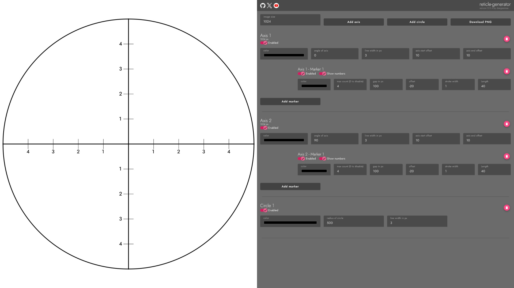

# Reticle Generator

The Reticle Generator is a versatile tool designed to simplify the process of creating reticles for game development prototyping. With this tool, developers can effortlessly generate reticles of any size, tailored to their specific needs.

This generator provides the flexibility to design reticles with custom axis, markers, numbering, and circles.

## Key Features:

- **Customizable Axis:** Easily add axis with markers and numbering in any colors to suit your game's aesthetics and requirements.

- **Adjustable Circles:** Define circles of any radius, stroke width, and color, allowing for precise visualization within your game environment.

- **Download as PNG:** Once your reticle is ready, simply download it as a transparent PNG file, ready to be integrated seamlessly into your game development workflow.

## Getting Started:

To start using the Reticle Generator, simply visit [https://reticle-generator.deegeemee.net](https://reticle-generator.deegeemee.net) and begin crafting your reticle with ease.

## How to Use:

1. Adjust the size of the reticle to your desired dimensions.
2. Customize the axis with markers and numbering, selecting colors that complement your game's visual style.
3. Add circles with specific radius, stroke width, and colors as needed.
4. Once satisfied with your design, download the reticle as a transparent PNG file.
5. Integrate the downloaded reticle into your game development project and enjoy the enhanced visual experience.

## Contributions:

Contributions are welcome! If you have any ideas for improvements or new features, feel free to fork this repository, make your changes, and submit a pull request.

## License:

This project is licensed under the [MIT License](https://github.com/deegeemee/reticle-generator/blob/main/LICENSE), allowing for both personal and commercial use with proper attribution. See the `LICENSE` file for more details.

---

**Disclaimer:** This tool is intended for game development prototyping purposes only. For production-level assets, consider using specialized design software for optimal results.
